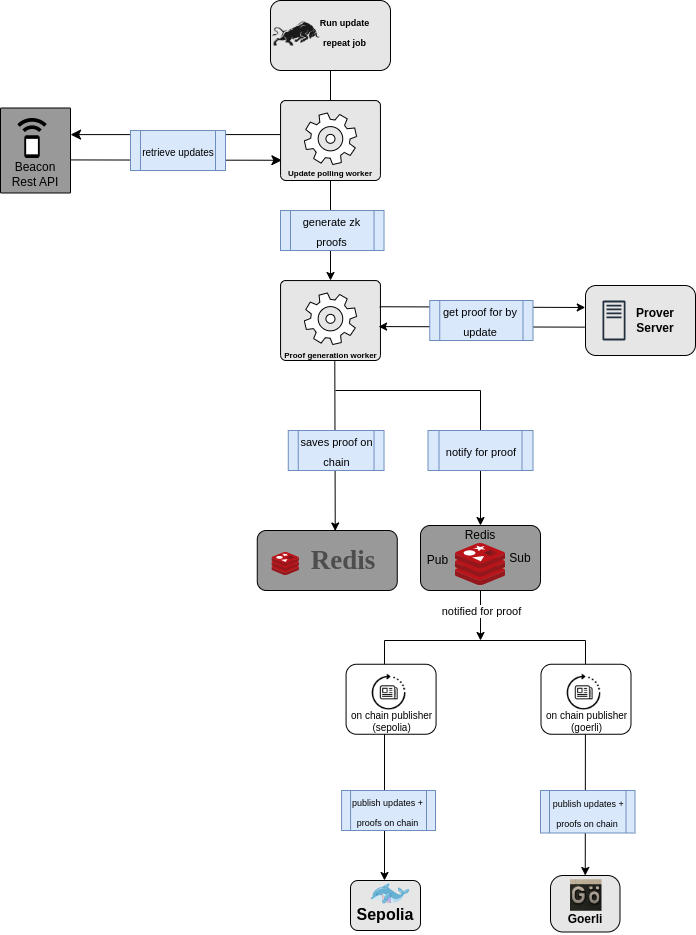

## Introduction

The DendrETH project implements the beacon chain [light client syncing
algorithm][0] in the form of a smart contract for multiple targeted
blockchains, aiming to enable the creation of secure cross-blockchain
bridges that don't require a trusted operator. In their current state,
our contracts are complete and suitable for testnet deployments, but
they are still not intended for production use.

For EVM-based blockchains, we build upon prior research by [0xPARC][1],
[Darwinia][2], [Alex Stokes][3] and the Nimbus team to deliver the
first end-to-end implementation capable of syncing the entire Mainnet
history since Altair. Our current [Solidity contract][4] leverages
a [Circom zero-knowledge circuit][5] to verify the BLS signatures of the
Ethereum 2 validators and all of the syncing protocol rules.

Since the base circuit is able to verify complete header-to-header
transitions, we also provide a recursive variant that can be used
by any Ethereum client to implement one-shot syncing capabilities
similar to the ones available in the [Mina][6] protocol (please see our
[analysis][7] regarding the limitations of this approach).

For blockchains based on WebAssembly and BPF, we are developing a [direct
implementation][8] of the light client syncing protocol based on the
highly efficient BLS, SSZ and Light client syncing libraries developed
by [Supranational][9] and the [Nimbus team][10]. When compared to the
similarly positioned [Snowbridge][11] project, our implementation
brings a 36-fold reduction in code size (2.2MB vs 60kb) which should
also translate in significant reduction in gas costs (currently, our
code is targeting only the standard WebAssembly run-time instead of
the full blockchain environments).

## Deployed instances of our smart contracts

| The smart contract is deployed in                                                                                                                                                | The targetted network is                                 | Circuit Version                                              |
| -------------------------------------------------------------------------------------------------------------------------------------------------------------------------------- | -------------------------------------------------------- | ------------------------------------------------------------ |
| [Goerli/Ethereum](https://goerli.etherscan.io/address/0xf65B59bc947865490eF92D8461e8B5D0eA87c343)                                                                                | [goerli](http://unstable.prater.beacon-api.nimbus.team/) | https://github.com/metacraft-labs/DendrETH/pull/94 (Capella) |
| [Goerli/Optimism](https://goerli-optimism.etherscan.io/address/0xa38f1c6F9F50dbd8d11AdD89c1A218F037498Bc1)                                                                       | [goerli](http://unstable.prater.beacon-api.nimbus.team/) | https://github.com/metacraft-labs/DendrETH/pull/94 (Capella) |
| [Goerli/Base](https://goerli.basescan.org/address/0x8A72855F61181BC3C281dE9C24EFc2571Fe96a04)                                                                                    | [goerli](http://unstable.prater.beacon-api.nimbus.team/) | https://github.com/metacraft-labs/DendrETH/pull/94 (Capella) |
| [Goerli/Arbitrum](https://goerli.arbiscan.io/address/0x6d38269d6670f73630FB3d481c58f064B63E123c)                                                                                 | [goerli](http://unstable.prater.beacon-api.nimbus.team/) | https://github.com/metacraft-labs/DendrETH/pull/94 (Capella) |
| [Sepolia/Ethereum](https://sepolia.etherscan.io/address/0xaf352346cE4c413Cc96f607e4FaBEF5aE523D7Bf)                                                                              | [goerli](http://unstable.prater.beacon-api.nimbus.team/) | https://github.com/metacraft-labs/DendrETH/pull/94 (Capella) |
| [Mumbai/Polygon](https://mumbai.polygonscan.com/address/0xcbF3850657Ea6bc41E0F847574D90Cf7D690844c)                                                                              | [goerli](http://unstable.prater.beacon-api.nimbus.team/) | https://github.com/metacraft-labs/DendrETH/pull/94 (Capella) |
| [Testnet/Fantom](https://testnet.ftmscan.com/address/0x83809AB88743ecfa320163430d769Fdf07278baf)                                                                                 | [goerli](http://unstable.prater.beacon-api.nimbus.team/) | https://github.com/metacraft-labs/DendrETH/pull/94 (Capella) |
| [Alfajores/Celo](https://alfajores.celoscan.io/address/0x85Ba37415962bc0828f7b986a9D52a2760a57317)                                                                               | [goerli](http://unstable.prater.beacon-api.nimbus.team/) | https://github.com/metacraft-labs/DendrETH/pull/94 (Capella) |
| [Chiado/Gnosis](https://blockscout.com/gnosis/chiado/address/0xAa5eeb05D0B080b366CB6feA00d16216B24FB9bE)                                                                         | [goerli](http://unstable.prater.beacon-api.nimbus.team/) | https://github.com/metacraft-labs/DendrETH/pull/94 (Capella) |
| [Testnet/EVMOS](https://testnet.mintscan.io/evmos-testnet/account/0x8E4D36CD13015EA6F384cab3342156b3dC5d0a53)                                                                    | [goerli](http://unstable.prater.beacon-api.nimbus.team/) | https://github.com/metacraft-labs/DendrETH/pull/94 (Capella) |
| [Malaga/Cosmos](https://block-explorer.malaga-420.cosmwasm.com/account/wasm12te4t793yq9jgqnyqauuvhza44ss43fxnsgj8lyxrqru6pc2c6ds68l4es)                                          | [goerli](http://unstable.prater.beacon-api.nimbus.team/) | https://github.com/metacraft-labs/DendrETH/pull/94 (Capella) |
| [Jungle/EOS](https://local.bloks.io/account/dendreth2222?nodeUrl=http%3A%2F%2Fjungle4.cryptolions.io&systemDomain=eosio&hyperionUrl=https%3A%2F%2Fjungle4history.cryptolions.io) | [goerli](http://unstable.prater.beacon-api.nimbus.team/) | https://github.com/metacraft-labs/DendrETH/pull/94 (Capella) |
| [Aurora/Near](https://explorer.testnet.aurora.dev/address/0xA3418F79c98A3E496A5E97610a97f82daE364619)                                                                            | [goerli](http://unstable.prater.beacon-api.nimbus.team/) | https://github.com/metacraft-labs/DendrETH/pull/94 (Capella) |
| [Gnosis/Gnosis](https://gnosisscan.io/address/0x2b2d8b2bcf1e98a46e773a0679d4ebcb8bfb6996)                                                                                        | [goerli](http://unstable.prater.beacon-api.nimbus.team/) | https://github.com/metacraft-labs/DendrETH/pull/94 (Capella) |

## Working with the Codebase

### Pre-requisites

Due to the large number of required compiler toolchains and blockchain
run-time environments targeted by this project, installing all pre-requisites
by hand is not practical. We are offering a deterministic build environment
based on the Nix package manager, which is best supported on Linux, but also
runs on macOS with some minor limitations at the moment. Windows users may try
to use Nix in the Windows Subsystem for Linux, but our team is not currently
testing this configuration.

See [Getting started with Nix][12] for more details.

Certain scripts in this repository will require API credentials for Infura
and Etherscan in order to be able to deploy the contracts in the official
networks. To specify such credentials, please create a file named `.env` and
place it at the root of your working copy. Its contents should look like this:

```bash
INFURA_API_KEY=1234567890abcdef1234567890abcdef
ETHERSCAN_API_KEY=1234567890ABCDEF1234567890ABCDEF12
```

### How does a smart contract sync with the network?

A normal light client will download light client updates from the Ethereum
P2P network or from the Beacon REST API of an Ethereum node. To sync a smart
contract, we perform the same process in reverse - we upload the light client
updates to the contract hosted on another blockchain in the form of regular
transactions. The contract is initialized with a starting bootstrap state and
it updates its view of the beacon chain with each processed update.

This allows it to maintain information about a recent finalized beacon chain
block header and a recent optimistic head. The information in these headers
is enough to authenticate any data point in the Ethereum ecosystem because a
beacon chain block header references a `BeaconState` root hash, which in turn
references a recent execution layer block header, which in turn references the
root hash of the execution layer state. Thus, if a chain of Merkle proofs is
also supplied and verified against the light client contract state, it can be
used to prove in the targeted blockchain the occurrence of any event in the
Ethereum world.

To facilitate the development of ours and other similar projects, we'll be
maintaining an archive of the best light client updates for each sync committee
period since Altair, as [produced by a fully-synced Nimbus node][13]:

https://github.com/metacraft-labs/eth2-light-client-updates

### EVM Simulation

Our archive of light client updates also includes pre-generated [zero-knowledge
proofs][14] for the latest version of the [light client Circom circuit][5].

To see a full syncing simulation in action, you can execute the following
commands:

```bash
git clone https://github.com/metacraft-labs/DendrETH.git
cd DendrETH
git submodule update --init --recursive
nix develop # or `direnv allow` if you are using direnv
yarn install
make evm-simulation
```

You should see a [Hardhat simulation](https://hardhat.org/hardhat-runner/docs/getting-started#overview),
sequentially processing all available updates. At the time of this writing, each
update costs around 330K in gas.

### Run relayer

To run the relayer you can execute

```bash
make build-relay-image
```

Which will build the relayimage for you. To run it

You can also pull the image from docker hub

```
docker pull dimaranti/dendreth
```

```bash
docker run -it --env-file .env -v relayvolume:/DendrETH/build relayimage
```

Passing the .env file with needed configurations.

The .env file must contain the following things

For accessing the networks and signing transactions:

```bash
USER_PRIVATE_KEY=private_key
ALCHEMY_API_KEY=api_key
```

To configure from which slot should the relayer start generating updates. And what step it should use

```bash
INITIAL_SLOT=5355991
SLOTS_JUMP=64
```

To configure relayer what network it should follow. Currently the script only supports following one network. You can mannually run the tasks for publishing and updating on a second network.

```bash
PRATTER=TRUE
MAINNET=FALSE
FOLLOW_NETWORK=pratter
```

You can also provide for addresses on different networks if you skip a network transactions won't be broadcasted to it

```bash
LC_GOERLI=0xf65B59bc947865490eF92D8461e8B5D0eA87c343
LC_OPTIMISTIC_GOERLI=0xa38f1c6F9F50dbd8d11AdD89c1A218F037498Bc1
LC_BASE_GOERLI=0x8A72855F61181BC3C281dE9C24EFc2571Fe96a04
LC_ARBITRUM_GOERLI=0x6d38269d6670f73630FB3d481c58f064B63E123c
LC_SEPOLIA=0xaf352346cE4c413Cc96f607e4FaBEF5aE523D7Bf
LC_MUMBAI=0xcbF3850657Ea6bc41E0F847574D90Cf7D690844c
LC_FANTOM=0x83809AB88743ecfa320163430d769Fdf07278baf
LC_ALFAJORES=0x85Ba37415962bc0828f7b986a9D52a2760a57317
LC_CHIADO=0xAa5eeb05D0B080b366CB6feA00d16216B24FB9bE
LC_EVMOS=0x8E4D36CD13015EA6F384cab3342156b3dC5d0a53
```

And also it needs to contain the hashi adapter addresses

Sample `.env`

```
USER_PRIVATE_KEY=private_key
ALCHEMY_API_KEY=api_key
REDIS_HOST=localhost
REDIS_PORT=6379
PROVER_SERVER_HOST=http://127.0.0.1
PROVER_SERVER_PORT=5000
INITIAL_SLOT=5860953
SLOTS_JUMP=32
PRATTER=TRUE
MAINNET=FALSE
LC_GOERLI=0xf65B59bc947865490eF92D8461e8B5D0eA87c343
LC_OPTIMISTIC_GOERLI=
LC_BASE_GOERLI=
LC_ARBITRUM_GOERLI=
LC_SEPOLIA=
LC_MUMBAI=
LC_FUJI=
LC_FANTOM=
LC_ALFAJORES=
LC_BSC=
LC_AURORA=
LC_GNOSIS=
LC_CHIADO=
LC_EVMOS=
LC_MALAGA=
GOERLI_HASHI=0x4169ea397fe83F55e732E11390807b3722374f78
OPTIMISTIC_HASHI=''
BASE_HASHI=''
ARBITRUM_HASHI=''
SEPOLIA_HASHI=''
MUMBAI_HASHI=''
FANTOM_HASHI=''
ALFAJORES_HASHI=''
CHIADO_HASHI=''
EVMOS_HASHI=''
MALAGA_HASHI=''
AURORA_HASHI=''
GNOSIS_HASHI=''
FUJI_HASHI=''
BSC_HASHI=''
```

### How does the relayer work?

We utilize BullMQ for our system.

We have set up a recurring job that repeats itself after a specified time interval (slotsjump) and starts from an initial slot. The job follows a specific network, currently supporting Pratter and Mainnet. To run this job, execute the following command in the `beacon-light-client/solidity` folder:

```
yarn hardhat run-update --initialslot $INITIAL_SLOT --slotsjump $SLOTS_JUMP --follownetwork pratter
```

The Update Polling Worker, responsible for executing this recurring job, is run by executing the following command in the `relay` folder:

```
yarn run pollUpdatesWorker
```

The Update Polling Worker retrieves updates from the Beacon REST API and saves the lastDownloadedUpdate for the job in Redis. Next time, the job starts from this point and adds a task for the Proof Generation Worker, which is executed using in the in the `relay` folder.

```
yarn run proofGenerationWorker
```

The Proof Generation Worker sends a request to the Prover Server, using input from the Update Polling task.

The Prover Server is started with the following command:

```
proverServer $PORVER_SERVER_PORT ./build/light_client.zkey
```

The Prover Server requires a path to a build folder containing the .zkey file. The build folder should also include an executable and a .dat file (light_client and light_client.dat) for witness generation. (Refer to Circom proof generation documentation for more details)

Upon completion of proof generation, the generated proof is saved in Redis. The system uses Redis pub/sub to notify that a proof is ready. Multiple instances subscribing to this notification attempt to publish the proof on-chain.

These instances can be executed using:

```
yarn hardhat start-publishing --lightclient $LC_ADDRESS --network goerli --follownetwork pratter
```

in the beacon-light-client/solidity folder.

#### Diagram of the relayer



### One-shot syncing simulation

Our archive of light client updates also includes pre-generated [zero-knowledge
proofs][14] for the latest version of the [one-shot syncing Circom circuit][20].

To see a simulation demonstrating the syncing process to any sync committee
period, you can execute the following commands:

```bash
git clone https://github.com/metacraft-labs/DendrETH.git
cd DendrETH
git submodule update --init --recursive
nix develop # or `direnv allow` if you are using direnv
yarn install
make one-shot-syncing-simulation
```

### Building the Circom circuits

The circuits employed by this project are some of the largest ever developed.
We are building upon the BLS primitives implemented by the [circom-pairing][1]
project and the SHA256 implementation from [circomlib][15], both of which are
already very large. To perform our compilations, we had to purchase a server
with 384GB of RAM where the fully integrated build takes the following amount
of time:

|                                      |          |
| ------------------------------------ | -------- |
| Circuit compilation                  | 6h       |
| Circuit Constraints                  | 88945803 |
| Witness generation C++ compilation   | 1h       |
| Witness generation                   | 3m       |
| Trusted setup phase 2 key generation | 26h      |
| Trusted setup phase 2 contribution   | N/a      |
| Proving key size                     | 49G      |
| Proving key verification             | N/a      |
| Proving time (rapidsnark)            | 4m       |
| Proof verification time              | 1s       |

You can examine the required commands for building the final circuit here:

https://github.com/metacraft-labs/DendrETH/blob/main/beacon-light-client/circom/scripts/proof_efficient/build_proof.sh

### Running the test suites

At the moment, there are multiple test suites of interest:

- The WebAssembly tests of the Nim light client:

  ```
  yarn test-emcc
  ```

- The Circom components test suite:

  ```
  cd beacon-light-client/circom
  yarn hardhat test
  ```

- The Solidity contract test suite:
  ```
  cd beacon-light-client/solidity
  yarn hardhat test
  ```

## License

All code within this repository is [licensed under GPLv3][16].

## Roadmap

Please check out our [roadmap][17] to learn more about the blockchains and the
use cases that we plan to support in the future.

[0]: https://github.com/ethereum/annotated-spec/blob/master/altair/sync-protocol.md
[1]: https://github.com/yi-sun/circom-pairing
[2]: https://github.com/darwinia-network/darwinia-messages-sol/blob/master/contracts/bridge/src/truth/eth/BeaconLightClient.sol
[3]: https://github.com/ralexstokes/deposit-verifier
[4]: https://github.com/metacraft-labs/DendrETH/tree/main/beacon-light-client/solidity
[5]: https://github.com/metacraft-labs/DendrETH/tree/main/beacon-light-client/circom
[6]: https://minaprotocol.com/
[7]: https://github.com/metacraft-labs/DendrETH/tree/main/docs/long-range-syncing
[8]: https://github.com/metacraft-labs/DendrETH/tree/main/beacon-light-client/nim
[9]: https://github.com/supranational/blst
[10]: https://github.com/status-im/nimbus-eth2
[11]: https://snowbridge.snowfork.com/
[12]: https://github.com/metacraft-labs/DendrETH/blob/main/docs/NIX.md
[13]: https://github.com/metacraft-labs/DendrETH/blob/main/docs/BEACON-REST-API.md
[14]: https://github.com/metacraft-labs/eth2-light-client-updates/tree/main/mainnet/proofs
[15]: https://github.com/iden3/circomlib
[16]: https://github.com/metacraft-labs/DendrETH/blob/main/LICENSE
[17]: https://github.com/metacraft-labs/DendrETH/blob/main/docs/ROADMAP.md
[18]: https://infura.io
[19]: https://etherscan.io
[20]: https://github.com/metacraft-labs/DendrETH/tree/main/beacon-light-client/circom/circuits/light_client_recursive.circom
