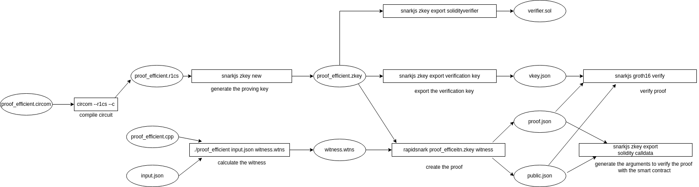
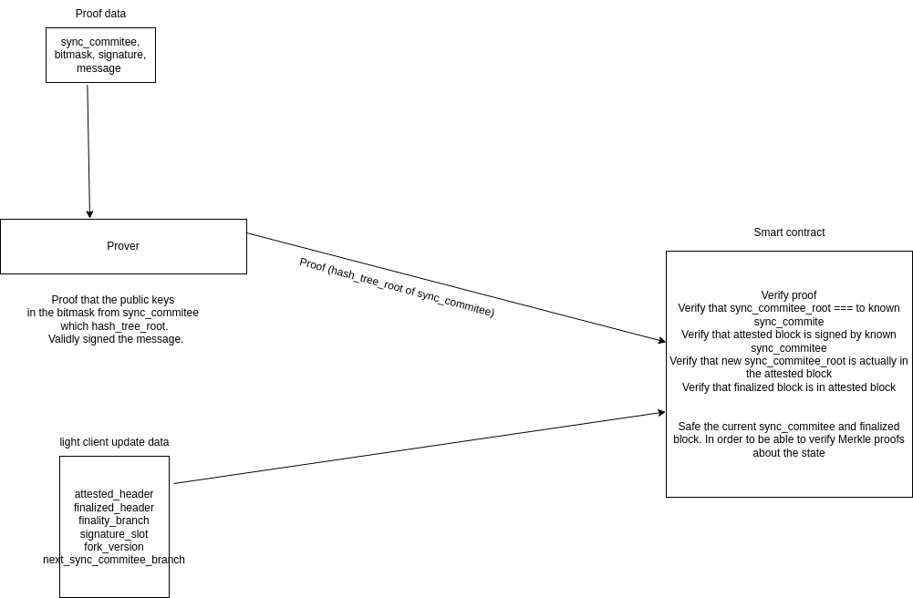

To run tests

```
yarn hardhat test
```

which will run test on the circuits. Have in mind that `aggregate-bitmask.test.ts` will take a few minutes.

In scripts folder you have the circuits with main components. And you can build them with the scripts. As well get example input from the JS scripts. For bigger circuits you may need up to hundreds of GB of RAM.


Also you have previous versions of this current branch in sync_implementation. Where most of the circuits are implemented in circom-pairing fork in sync_protcol branch.
Circuits are executed with commands from the scripts and data is feeded from JS scripts there.
For bigger circuits you may need up to hundreds of GB of RAM.

## Benchmarks

All benchmarks were run on a 32-core, 384G RAM machine with 1TB hard drive (AWS r5.8xlarge instance). Constraints refer to non-linear constraints.

|                                      | proof_efficient |
| ------------------------------------ | --------------- |
| Constraints                          | 88945803        |
| Circuit compilation                  | 6h              |
| Witness generation C++ compilation   | 1h              |
| Witness generation                   | 3m              |
| Trusted setup phase 2 key generation | 26h             |
| Trusted setup phase 2 contribution   | N/a             |
| Proving key size                     | 49G             |
| Proving key verification             | N/a             |
| Proving time (rapidsnark)            | 4m              |
| Proof verification time              | 1s              |

Diagrams



