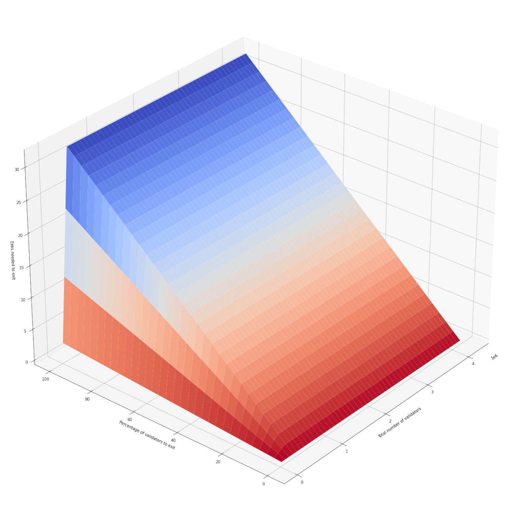

# Safety considerations for long-range Ethereum light client syncing

Authors: Yordan Miladinov,
         Zahary Karadjov

### Introduction

Altair introduced the concept of [sync committees](https://ethereum.org/en/glossary/#sync-committee "small group of randomly selected validators.") that now make it possible for [light clients](https://ethereum.org/en/glossary/#light-client "Client that does not store a local copy of the blockchain.") (such as phones, tablets, IoT devices, etc.) to quickly come online and start interacting with the blockchain.

Such participants in the network face the well-known risk of a long-range attack where a malicious actor is presenting an alternative history of the blockchain that is indistinguishable from the real one. Such a history may be forged with the signing keys of many validators who have already exited the network and have nothing to lose if they surrender their keys.

The counter measure employed by Ethereum is to require all clients to always start syncing from a trusted recent checkpoint, which guarantees that the maximum number of exited validators will not be sufficient for carrying out an attack. This notion is known as weak subjectivity and it's explored in detail[^1][^2][^3][^4][^5] for full Ethereum nodes, but new device types come with different usage patterns and introduce new security concerns.

This document analyses weak subjectivity from the perspective of light clients. The light client software may be pre-configured with a trusted bootstrap state and it may rely on recursive zero-knowledge proofs (as developed by the DendrETH project) to perform one-shot syncing over a long-range. A critical question is what is the longest possible range for this operation to remain safe?


### Sync committee corruption

The Ethereum specification is clear that, if _at least 2/3_ of the sync committee signs a block header, it's safe to assume that block is part of the canonical chain[^6].

The following figure visualizes what portion of the entire validator set has to be maliciously organized in order to achieve a non-negligible chance of forming a sync committee super-majority of 2/3 or more and, in turn, compromise light clients. Please note that a light client performing a long-range sync may use a slightly modified version of the syncing algorithm which requires all updates to have such super-majority.

__Figure 1__: Probability of sync committee corruption


Even though this plot appears flat, please note that the risk is still exponentially raising as we increase the percentage of malicious validators.

At the green dot (~44.2% of the validators have turned malicious), the risk of malicious super-majority is 2<sup>-80</sup> which can be considered negligible.

The orange dot represents probability of 2<sup>-40</sup> at ~51.2% malicious validators which is still quite reasonable.

The red dot represents probability of 2<sup>-20</sup> with ~56.3% of the validators being malicious which is not an acceptable risk.

We choose to proceed our exploration with the lowest probability of corruption (the green dot).

Details on the computation can be found here: [notebooks/corruption](./notebooks/corruption.ipynb)


### Long-range attacks

For the purposes of our analysis, we will assume that every validator exiting the validator set will immediately turn malicious. This is very unlikely to happen in practice due to the fact that validators are typically anonymous (and thus difficult to bribe) and most will continue to have wider stake in Ethereum which will make them unlikely to cooperate with the attacker.

As discussed previously, vulnerable to long-range attacks are Ethereum clients who haven't synced with the blockchain for a while. Since they have an outdated view of the chain, they cannot be aware of which validators have exited (or got slashed). The malicious actor only needs to create a single light client update with a super-majority of the signing keys that correspond to this old state of the ligth client in order to lead it into an alternative history where each next sync committee is also under the control of the attacker.

Ethereum implements a churn limit[^7] that specifies the maximum number of validators that can join or exit the validator set at any epoch. If there are more validators wanting to join or exit, a queue is formed, but the churn limit is always strictly respected.

Taking into account the churn limit and the required percentage of malicious validators needed to compromise a sync committee (Figure 1), we can compute exactly how long it would take for that many validators to exit:

__Figure 2__: How long it takes (in eeks) for a portion of the validator set to exit


*Note 1*: We don't have to take into account exited validators so far as there are basically none (as of slot 4759088 of the Mainnet). See `scripts/validators_by_status.sh` for details.

|               Status |   Count |
| -------------------- | ------- |
|       active_ongoing |  432282 |
|       active_slashed |       5 |
|       exited_slashed |      27 |
|  pending_initialized |     167 |
|       pending_queued |    1148 |
|  withdrawal_possible |     860 |


*Note 2*: The strange shape of the 3D figure is due to churn limit minimum[^7]. When there are `CHURN_LIMIT_QUOTIENT * MIN_PER_EPOCH_CHURN_LIMIT` (i.e. 2<sup>18</sup>) or more validators (and there are 1.65x that much already), the function is linear. Here's a 2D cut:

__Figure 3__: 2D cut (2^18 or more validators, dot represents 44.2%)


It turns out that ~14.165 eeks (~128.93 days) are needed for 44.2% of the active validators to exit. Thus we can conclude that, if a light client seeks a sync committee super-majority of at least 2/3, it's safe to sync at least once every 128.74 days.

Details on the computation can be found [here](./notebooks/churn.ipynb).

_But what if a light client is slightly more outdated?_


### Dynamic period

A theoretically safe approach for outdated devices to increase their safe syncing range is to require a greater sync committee majority, i.e. greater than 2/3. Such greater majority would require more validators to turn malicious before the sync committee can be corrupted, thus increasing the required time for the sufficient number of validators to have exited.


|    | SC Majority        |  Safe Eeks |  Safe Days |
|---:|-------------------:|-----------:|-----------:|
|  0 |  2/3%              |    14.165  |    128.933 |
|  1 | 70.0%              |    15.2628 |    138.925 |
|  2 | 75.0%              |    16.9462 |    154.248 |
|  3 | 80.0%              |    18.7985 |    171.108 |
|  4 | 85.0%              |    20.7817 |    189.16  |
|  5 | 90.0%              |    22.8615 |    208.091 |
|  6 | 95.0%              |    25.3308 |    230.566 |

This means that in practice, if the light client is presented with a chain of light client updates with higher sync committee participation, it can adjust its accepted syncing range accordingly.

Let's say a light client is outdated by 230 days. For the next 22 days of catching up it might require blocks, signed by at least 95% of respective sync committees. When the client is just 208 days behind, it might relax that requirement to just 90%. That dynamic adjustment keep on until the client is <128.93 days behind, when it falls back to the standard 2/3s.

The same principle can be applied when accepting a one-shot syncing zero-knowledge proof which can feature the minimum sync committee participation rate in the entire chain of header transitions.


### Observed sync committee participation on Mainnet

[An analysis](./analysis/participation.ipynb) of all [light client updates](https://github.com/metacraft-labs/eth2-light-client-updates) since the Altair fork (at slot 2375680) up to slot 4731420 shows that the minimal sync committee participation so far is 97%.

__Figure 4__: `SyncAggregate` participation rate in all blocks for slots 2375680-4731420


In conclusion: so far sync committees prove reliable for light clients to sync at least once every ~230.5 days.


### `sync_committee_slashing` proposal

At the moment, the security of light clients is somewhat reduced by the fact that there is no slashing mechanism preventing the sync committee members from carrying out the discussed long-range attacks against syncing nodes or other attacks against light client smart-contract bridges (such as the ones developed by the DendrETH project).

Since a light client can be compromised only by manipulating it to accept an incorrect `next_sync_committee` which can only be derived from a finalized Ethereum block, it's clear that any members of a sync committee that signs such a conflicting `LightClientUpdate` is lying about the finalized portion of the chain and can be safely slashed.

We propose the addition of a new `sync_committee_slashing` topic where observed malicious `LightClientUpdates` can be broadcasted. The clients will use the following pseudo-code to confirm the slashings:

```python

def process_sync_committee_slashing(state: BeaconState, update: LightClientUpdate):
  finalized_slot_in_state =
    compute_start_slot_at_epoch(state.finalized_checkpoint.epoch)

  if update.finalized_header.slot <= finalized_slot_in_state and
     not is_ancestor(update.finalized_header, state.latest_block_header):
    for index in participating_indices(update):
      if is_slashable_validator(state.validators[index], get_current_epoch(state)):
        slash_validator(state, index)
```

As with other slashings, the penalty can be proportional to the number of participating validators. This will ensure that in the case of an actual attack with a sync committee majority, the most severe penalty will be imposed.

### References:
[^1]: Buterin, Vitalik (November 2014), [Proof of Stake: How I Learned to Love Weak Subjectivity](https://blog.ethereum.org/2014/11/25/proof-stake-learned-love-weak-subjectivity); Ethereum Blog

[^2]: Asgaonkar, Aditya (2020) [Weak Subjectivity in Eth2.0](https://notes.ethereum.org/@adiasg/weak-subjectvity-eth2); Ethereum Notes

[^3]: Asgaonkar, Aditya (2020) [Weak Subjectivity in Eth2.0](https://www.youtube.com/watch?v=9avhMNJWnmw); EDCON 2020

[^4]: Asgaonkar, Aditya & co (September 2020), [Weak Subjectivity Guide](https://github.com/ethereum/consensus-specs/blob/dev/specs/phase0/weak-subjectivity.md); Ethereum Proof-of-Stake Consensus Specifications

[^5]: Asgaonkar, Aditya; Park, Daejun (December 2020), [Analysis on Weak Subjectivity in Ethereum 2.0](https://github.com/runtimeverification/beacon-chain-verification/blob/master/weak-subjectivity/weak-subjectivity-analysis.pdf); Formal Verification of Beacon Chain Specification

[^6]: Buterin, Vitalik & co (May 2021), [Minimal Light Client](https://github.com/ethereum/annotated-spec/blob/master/altair/sync-protocol.md#lightclientstore); Annotated Ethereum Specification

[^7]: Buterin, Vitalik & co (May 2021), [`get_validator_churn_limit()`](https://github.com/ethereum/annotated-spec/blob/master/phase0/beacon-chain.md#get_validator_churn_limit); Annotated Ethereum Specification
