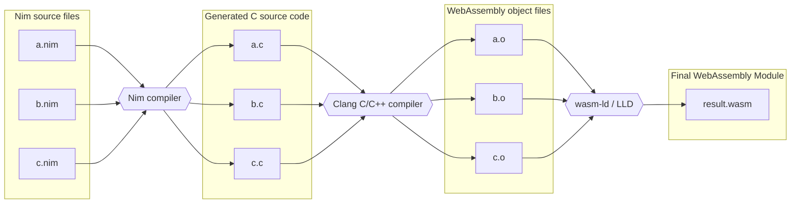

# Compiling Nim to WebAssembly __without Emscripten__

## Start with a basic Nim file

Create a `*.nim` file with some functions. For example, here's [`add.nim`](./add.nim):

```nim
proc print(value: float64) {.importc, cdecl.}

proc sum*(a,b: float64): float64 {.cdecl, exportc, dynlib.} =
  a + b

proc printAdd*(a,b: float64) {.cdecl, exportc, dynlib} =
  print(sum(a, b))

proc start*() {.exportc: "_start".} =
  discard
```

## Configure the Nim compiler

Add a `config.nims` compiler configuration file next to the `*.nim` file. See the [one included in this repo](./config.nims).

## Compile it

Run the following command to compile `add.nim` to `add.wasm`:

```sh
nim c -o:add.wasm add.nim
```

## Verify that it works

To test generated Wasm module in the browser, open [index.html](./index.html).

## How it works


